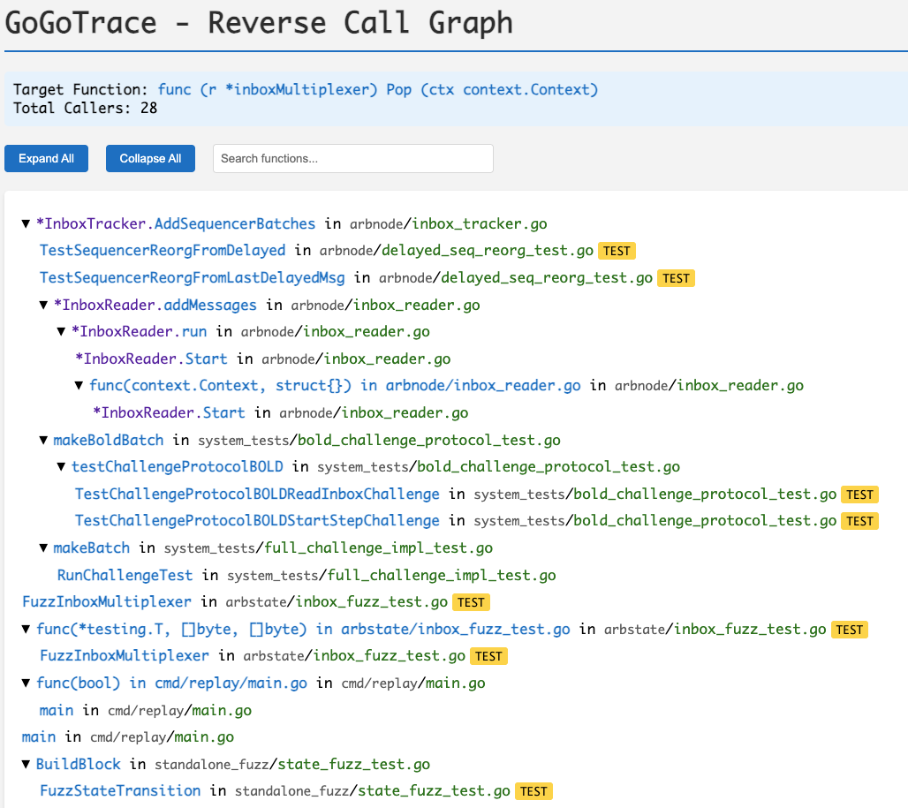

# GoGoTrace

GoGoTrace is a Go reverse call‑graph analyzer. It scans a project, discovers who calls a given function or method, and renders a reverse call tree to the console, to JSON, or to an interactive HTML page. The analysis runs in parallel and is designed to handle large codebases efficiently.

## Motivations

I built GoGoTrace because I could not find a Go tool that lets me start from an exact function signature and deterministically trace all of its callers, recursively, as a proper reverse call chain. Tools like go-callvis are useful for high‑level visualization, but they primarily produce an HTML call graph and typically require you to point at whole packages; they do not let you backtrace from a single function the way a debugger backtrace does. GoGoTrace fills that gap.

It also fits LLM‑driven workflows. You can ask an LLM to inspect a particular function and then, using GoGoTrace’s reverse call tree as context, reason about how upstream callers may or may solve your problem.
For example, as a security engineer, you might prompt: _“I believe there’s a bug in this function; search in every calling function whether there is a mitigation that would stop this bug.”_ Because LLMs are not reliable at exhaustively and deterministically enumerating callers, supplying the concrete call tree improves both accuracy and speed. In the same way, it can be useful for security researchers to search for the highest caller in the tree of given vulnerable specific function, to analyze if that is user/attacker-reachable or not.

If you're interested about Go security tooling, feel free to also have a look at [go-panikint](https://github.com/kevin-valerio/go-panikint).

## Installation

Build the CLI from source in this repository, then run the binary from your shell. Go 1.21 or newer is required (see `go.mod`).

```bash
go build -o gogotrace .
```

## Quick start

Run the tool against the current directory and trace a simple function:

```bash
./gogotrace -func "func main()"
```

Point the tool at another project, trace a method by its signature, and exclude test callers:

```bash
./gogotrace -dir ~/code/myproject -func "func (s *Server) Start(ctx context.Context)" -no-test
```


## Usage

The general form is `gogotrace -func "<function signature>" [options]`.

The most important flag is `-func`, which specifies the function or method signature to trace. The `-dir` flag sets the directory to analyze and defaults to the current directory. The tool can write JSON to a file via `-json <path>` and an interactive HTML page via `-html <path>`. Test callers can be removed from the output with `-no-test`. If you are unsure of the exact signature, use `-list <substring>` to print functions whose name or signature contains that substring. Extra diagnostics can be enabled with `-debug`. Pass `-help` to print the built‑in usage summary.

Here are several concrete invocations:

```bash
./gogotrace -func "func (r *inboxMultiplexer) advanceSequencerMsg()"
./gogotrace -func "func WithAPIServer(api *server.Server) Opt" -no-test
./gogotrace -func "func Process()" -json output.json
./gogotrace -func "func main()" -html callgraph.html
./gogotrace -dir ~/myproject -func "func Init()" -no-test
```

## Output formats

The console view (the default) prints a readable tree to standard output. The HTML view (`-html <path>`) writes an interactive page that supports expanding and collapsing nodes and a client‑side search box that highlights matching function names. The JSON view (`-json <path>`) writes a machine‑readable tree. A representative JSON fragment looks like the following:

```json
{
  "name": "Start",
  "receiver": "*Server",
  "package": "github.com/your/module/internal/service",
  "file": "service.go",
  "line": 42,
  "signature": "func (s *Server) Start(ctx context.Context)",
  "isTest": false,
  "children": [
    {
      "name": "Run",
      "receiver": "*Server",
      "package": "github.com/your/module/cmd/api",
      "file": "server.go",
      "line": 10,
      "signature": "func (s *Server) Run()",
      "usages": 1,
      "isTest": false,
      "children": [
        { "name": "main", "package": "github.com/your/module/cmd/api", "file": "main.go", "line": 5, "signature": "func main()" }
      ]
    }
  ]
}
```

#### Generated HTML example:




## Notes and limitations

This is a best‑effort static analysis based on the Go AST and does not perform full type checking or package resolution. Method resolution uses receiver‑name heuristics, which means dynamic dispatch through interfaces and some complex patterns may be missed. In very large or highly dynamic codebases the results can contain false positives or false negatives.

Some anonymous functions aren't caught. Let's take for example the following snippet. If `./gogotrace -func "func b()"` is called, `myPrivateFunc` won't be found.
```go
myPrivateFunc := func(a bool) bool {
	b()
	return false
}
```

Method values passed as arguments are detected, but indirect calls through function variables may not be fully traced through complex call chains.

## Troubleshooting

If no callers are reported, confirm the exact signature using `-list` and double‑check the `-dir` value. When exploring production‑only paths, add `-no-test` to remove test callers. If you need extra detail while iterating, run with `-debug` to see information about the root and its immediate callers.
